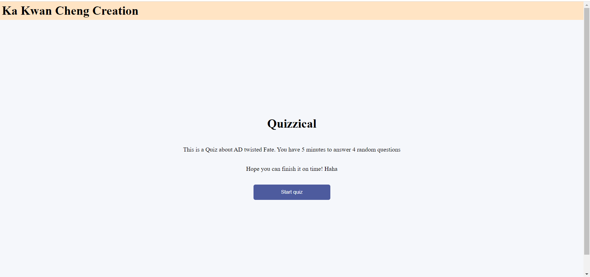

## the quizCalll App

I have been through a lot of quizzes in my life.
 
Everytime the quiz pops up on Canvas, or any other platforms,
 
I wonder how it is implemented. So I created one for my own.
Link: [quizCalApp](https://prod.d2fimk63dmdzuc.amplifyapp.com/)

### Design Process

The idea is to use an API endpoint provided from a free open sourced test bank to generate quiz questions.
 
The category of the questions involve Entertainment, Science, History...etc
 
To change the number of questions and topic on the quiz, you can simply go to the testbank link provided below to generate a new one,
and replace it on App.js.

### Challenges I faced

1. Since we are fetching the questions data from another API, the object fromat received is not as expected as JSON, it contains some HTML entity. To retrieve a human readable object, I have to lookup for library to decode into normal String.
2. The object received has multiple layers. To actually take the data we need for a questions, I have to take the necessary data from the object, and remodel the object as the one format that I needed.
3. have to manage and design multiple state throughout the applications.

### Library I used

- [html-entity](https://www.npmjs.com/package/html-entities)
- [Questions-Bank](https://opentdb.com/api_config.php)

### User Interactive Process

the start page
 

 
the problem page
 

 
the answer is filled UI
 

 
the quiz is finished
 

